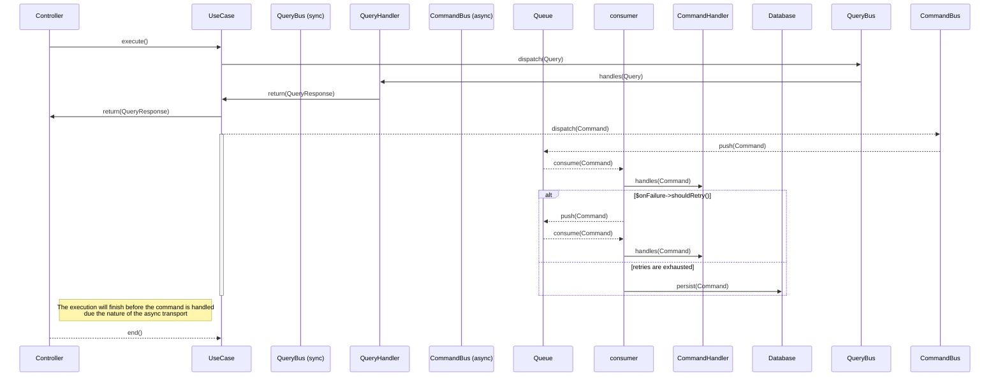

# slim and symfony/messenger for sync and async messages handling

This is a simple example of how to use `slim` and `symfony/messenger` together to be used as `sandbox` for all team to play and understand how to work with `slim` and `symfony/messenger`. 

A `command`, `query` or `event`, can be dispatched to any bus (`sync` and `async`) so you can decide the behaviour depending on your use case flow.


## Usage
### Make Targets
To start the project you need to run the following commands:

```sh
make build
make start
make follow-logs # to see the logs 
make stop
make run CMD="{$cmd}" # to run any command inside the container
```

### Console Commands
The symfony messenger commands are available to be used as well in the slim app:

```sh
bmake run CMD="bin/console list messenger" # show all the commands available under the messenger component in the slim app
```
> For more details about the all the commands you can check the [symfony messenger documentation](https://symfony.com/doc/current/messenger.html)

## Usage
The application comes with one Query and two Commands to be used as an example (one of the commands is sent using the async bus), you can test the use case with the following steps:

```sh
make start # to start the app
for i in {1..10}; do curl -X GET http://0.0.0.0:8080/cqrs; done # to execute the use case with the query and commands
make follow-logs # to see the logs (you'll see that ONLY the sync query and command has been handled)
make run CMD="bin/console messenger:consume --bus={name} --time-limit=60 -vv" # to consume the async messages from rabbitmq
make run CMD="bin/console messenger:failed:show --transport={name} -vv" # to see the failed messages in the database storage
make run CMD="bin/console messenger:failed:retry --transport={name} -vv" # to retry a failed (re send to rabbitmq queue)
make run CMD="bin/console messenger:failed:remove --transport={name} -vv" # to remove a failed message from the storage
```

## Notes
- `src/Infrastructure/Provider/Messenger`: This folder holds all the classes used to configure the component inside the SLIM app.
- `src/Application/Command/` : Folder with all the commands.
- `src/Application/Query/` : Folder with all the queries.
- `app/settings` : To know all the settings you could tweak with the `symfony/messenger` component.

## Sequence Diagram

`async` bus aka `"Fire and Forget"`: The bus will dispatch the message and return immediately.

`sync` bus aka `"Wait and Return"`: The bus will dispatch the message and wait for the response.



